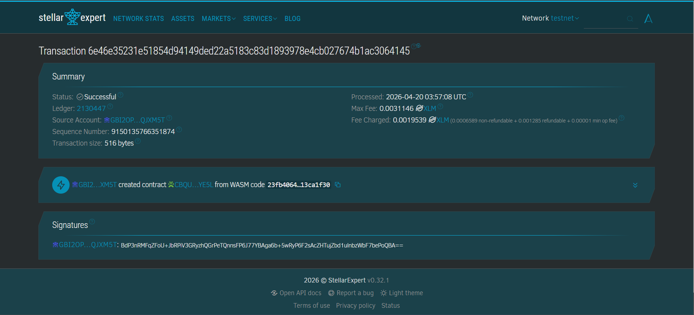

# 🌟 Stellar MicroWork DApp
### Blockchain-Based Decentralized Micro-Task Payment Protocol

> *A trustless, transparent, and borderless platform for micro-work — powered by Stellar Soroban smart contracts.*

---

## 📖 Project Description

**Stellar MicroWork DApp** is a decentralized smart contract solution built on the Stellar blockchain using Soroban SDK. It provides a trustless and transparent platform for managing micro-work tasks with escrow-based payments directly on-chain.

The protocol eliminates the need for intermediaries by leveraging smart contracts to securely hold funds, validate task submissions, and automatically release payments upon approval. All transactions and job states are recorded on-chain, ensuring **transparency**, **immutability**, and **fairness** between requesters and workers.

The system allows users to create jobs, fund them, assign workers, submit work via decentralized storage (IPFS), and trigger automatic payouts through predefined smart contract logic.

---

## 🚀 Project Vision

Our vision is to reshape the future of digital labor by:

| Goal | Description |
|------|-------------|
| 🚫 Eliminating Intermediaries | Removing centralized platforms that charge high fees and delay payments |
| 💪 Empowering Workers | Enabling global access to fair, instant, and borderless income opportunities |
| 🔒 Ensuring Trustless Payments | Using smart contracts to guarantee automatic and secure payouts |
| 🔍 Enhancing Transparency | Making all transactions and workflows publicly verifiable on-chain |
| 🏗️ Building Open Infrastructure | Creating a decentralized protocol that anyone can integrate and build upon |

> We envision a future where digital work is **permissionless**, **transparent**, and **fairly compensated** without reliance on centralized authorities.

---

## ✨ Key Features

### 1. 📋 Decentralized Job Creation
- Create micro-work tasks with metadata stored on IPFS
- Define payment amount, deadline, and job details
- Unique job ID generation on-chain
- Fully transparent job lifecycle

### 2. 🔐 Trustless Escrow System
- Funds are locked in smart contract escrow
- No third-party custody of assets
- Guaranteed payment availability before work begins
- Secure handling of all financial transactions

### 3. 👷 Worker Participation
- Workers can directly take available jobs
- Permissionless participation model
- Transparent assignment and tracking
- Real-time job status updates

### 4. 📤 Submission & Verification
- Submit completed work via IPFS hash
- Immutable proof of submission
- Timestamped records on blockchain
- Secure and verifiable workflow

### 5. ⚡ Automatic On-Chain Payment
- Instant payout upon approval
- Atomic transactions (no partial failures)
- No delays or manual processing
- Fully trustless financial execution

### 6. 🛡️ Transparency and Security
- All job states stored on-chain
- Immutable transaction history
- Protected against manipulation
- Deterministic smart contract logic

### 7. 🌐 Stellar Network Integration
- Low transaction fees
- Fast settlement time
- Built using Soroban Smart Contract SDK
- Scalable for micro-payment use cases

---

## 📜 Contract Details

| Field | Value |
|-------|-------|
| **Contract Address** | `CBQUGYNIE7FLW74SFVXRWGR6L6PY2AFLWWEH3RXCJYNON34ORAJPYE5L` |
| **Network** | Stellar Testnet (https://lab.stellar.org/r/testnet/contract/CBQUGYNIE7FLW74SFVXRWGR6L6PY2AFLWWEH3RXCJYNON34ORAJPYE5L) |
| **Explorer** | [View on Stellar Expert](https://stellar.expert/explorer/testnet/tx/6e46e35231e51854d94149ded22a5183c83d1893978e4cb027674b1ac3064145) |

### 🖼️ Testnet Screenshot
> 

---

## 🔮 Future Scope

### Short-Term Enhancements
- **Multi-Worker Jobs** — Support batch tasks with multiple workers per job
- **Auto-Approval Mechanism** — Automatic payment release after deadline if no review
- **Basic Reputation System** — Track worker performance and success rate
- **Improved UI/UX** — Simplified wallet interaction and onboarding

### Medium-Term Development

**Dispute Resolution System**
- On-chain dispute handling
- Stake-based arbitration mechanism
- Fair resolution for rejected submissions

**Milestone-Based Payments**
- Split jobs into multiple payouts
- Progressive work validation

**Supporting Infrastructure**
- Notification layer — off-chain alerts (email / webhook / messaging)
- Indexing layer — efficient job querying using off-chain indexer

### Long-Term Vision

| Feature | Description |
|---------|-------------|
| 🏛️ DAO Governance | Community-driven protocol upgrades |
| 🔗 Cross-Platform Integration | Integration with external job marketplaces |
| 🪪 Decentralized Identity (DID) | Worker identity and credential verification |
| ⭐ On-Chain Reputation System | Fully decentralized scoring mechanism |
| 🌉 Multi-Chain Expansion | Extend protocol beyond Stellar |
| 🤖 AI Task Integration | Support for AI-related micro-work (e.g., data annotation) |

### Enterprise Features
- **B2B Task Automation** — Enterprise micro-task outsourcing
- **Audit Trail System** — Immutable logs for compliance
- **Workflow Automation** — Smart contract-driven task pipelines
- **API Integration Layer** — Integration with enterprise systems

---

## 🛠️ Technical Requirements

```
Blockchain    →  Stellar (Soroban Smart Contracts)
Language      →  Rust
SDK           →  Soroban SDK + Stellar SDK (JavaScript)
Storage       →  IPFS (decentralized metadata & submissions)
```

---

## 🚦 Getting Started

Deploy the smart contract to Stellar's Soroban testnet and interact with it using the core functions:

```rust
create_job()    // Create a new job with metadata and payment details
fund_job()      // Deposit funds into escrow
take_job()      // Worker accepts the job
submit_work()   // Submit completed work (IPFS hash)
approve_work()  // Approve submission and trigger automatic payment
cancel_job()    // Cancel job and refund escrow
```

---

<div align="center">
  <sub>Built with ❤️ on Stellar Soroban — Decentralizing the future of work.</sub>
</div>